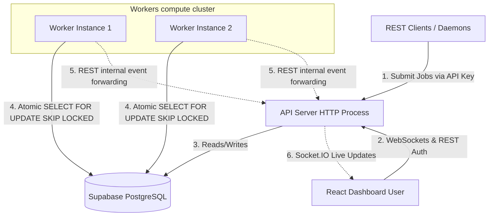
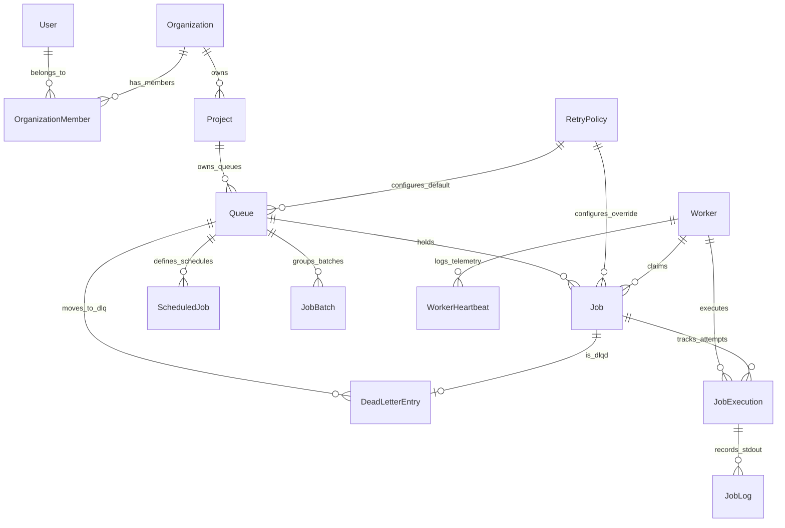

# Distributed Job Scheduler — Design Decisions

This document outlines the architectural patterns, database schemas, and engineering design decisions implemented in this Distributed Job Scheduler.

---

## 1. Multi-Tenancy & Isolation Model

### 1.1 Double Authentication Paths
To support both user dashboard sessions and programmatic server-to-server job submissions:
- **JWT Authentication:** Used by the React frontend. Tokens contain `userId`, `email`, and `role` to authenticate organization members.
- **Project API Keys:** Used by client daemons to submit/manage jobs. API keys are formatted with a prefix (`jsk_`) and 64 hex characters.

### 1.2 Fast $O(1)$ API Key Lookup
To prevent database search performance degradation:
- API keys are **hashed using SHA-256** instead of `bcrypt` when creating projects.
- SHA-256 is extremely fast and secure for randomly generated tokens of high entropy, allowing $O(1)$ database match index searches using PostgreSQL unique constraints.
- In-flight request keys are hashed in memory and matched against the `apiKeyHash` column.

### 1.3 Tenant Security Boundaries
- Created the custom `checkProjectAccess` middleware.
- Whenever an API key is used, the middleware extracts the project metadata and guarantees that the queue ID, job ID, or project ID in request params belongs strictly to that project.
- Bypassing tenant scopes (e.g. attempting to list/submit jobs to another project's queue) triggers an immediate `403 Forbidden` response, preventing horizontal privilege escalation.

---

## 2. Atomic Job Claiming & Concurrency Limits

### 2.1 SELECT FOR UPDATE SKIP LOCKED
- Built on raw PostgreSQL transaction primitives to solve race conditions when multiple worker processes claim the same job (double execution).
- `FOR UPDATE` locks the matching job records.
- `SKIP LOCKED` ensures that if worker A is currently locking/claiming a set of jobs, worker B will skip those rows immediately without blocking, increasing worker throughput.

### 2.2 Strict Queue-Level Concurrency Enforcing
- To prevent a queue from exceeding its `maxConcurrency` limit under load:
  1. `claimJobs` counts currently active claims (`claimed` or `running`) in the database for each polling queue in a transaction.
  2. Cals `capacity = maxConcurrency - activeCount`.
  3. Capps the SQL query `LIMIT` by `Math.min(capacity, workerFreeSlots)`.
  4. Runs the CTE `SELECT FOR UPDATE SKIP LOCKED` matching `queue_id`.
- This ensures that workers never over-commit a queue's concurrency limits, even when multiple workers claim concurrently.

---

## 3. Cross-Process WebSocket Updates

### 3.1 Network Event Bridge
- Workers run in separate OS processes from the HTTP/WebSocket API server. They load services directly to update database records (completing/failing jobs).
- Since workers cannot directly interact with Socket.IO client connections on the API process:
  1. `SocketService` detects if it is running outside the API server (no local Socket.IO instance attached).
  2. If so, it forwards updates by sending a secure HTTP POST request to `/api/v1/internal/event`.
  3. The API server authenticates this payload using `JWT_ACCESS_SECRET` and broadcasts the update to the client's project room (`project:${projectId}`).
- This guarantees real-time UI updates (jobs claiming, finishing, or failing) on the dashboard without requiring complex message broker setups like Redis in v1.

---

## 4. Crash Recovery & Resilience (Reaper)

### 4.1 Stale Workers Detection
- Workers emit heartbeats every 5 seconds, updating their `lastHeartbeatAt` timestamp and recording active job load history.
- The `ReaperService` runs every 15 seconds:
  1. Queries all workers with `lastHeartbeatAt < NOW() - 30 seconds`.
  2. Marks stale workers as `offline`.
  3. Requeues their active claimed/running jobs (resets status to `queued` and increments attempts count).
  4. Records the timeout error in the execution history log timeline.
- This prevents jobs from getting permanently stuck in `running` or `claimed` states if a worker process crashes, loses power, or gets killed.

---

## 5. System Architecture & Diagrams

### 5.1 System Architecture Diagram
The diagram below illustrates how client REST apps, the React dashboard, the API server, the PostgreSQL DB, and workers interact:



### 5.2 Entity Relationship (ER) Diagram
Our database schema is highly structured and normalized to model organizations, projects, queue setups, jobs, and execution history:



---

## 6. Database Design Considerations

### 6.1 Primary & Foreign Keys
- **UUIDs everywhere:** Every entity (Users, Organizations, Projects, Queues, Jobs, Executions, Workers, Logs) uses UUIDv4 keys. This prevents resource enumeration attacks (e.g. attempting to guess `/jobs/1234` sequentially) and ensures unique IDs in distributed environments.
- **Strict Foreign Keys:** Foreign keys (e.g. `queue_id` on `jobs`) maintain integrity at the storage engine level, preventing orphan records.

### 6.2 Index Optimizations
- **Critical Compound Index:**
  ```prisma
  @@index([queueId, status, runAt, priority])
  ```
  This index on the `jobs` table is the most critical performance optimize. The atomic claim query queries jobs matching `queueId`, `status = 'queued'`, and `runAt <= NOW()`, ordered by `priority DESC` and `runAt ASC`. This compound index allows PostgreSQL to perform an **Index Scan** directly on index nodes, fetching the top rows in $O(\log N)$ time, locking them, and returning immediately without table scans.
- **Relational Indexes:** Foreign keys (e.g., `batchId`, `jobExecutionId`, `workerId`) are explicitly indexed to optimize JOIN performance when loading the dashboard metrics and timelines.

### 6.3 Cascading Behavior & Hygiene
- **Cascade Deletes (`onDelete: Cascade`):** 
  - Deleting an organization deletes projects, queues, jobs, and all child executions, logs, and DLQ entries automatically. This guarantees no leaked/orphan rows in database tables.
- **Restrictive Safeguards (`onDelete: Restrict`):**
  - Used on `OrganizationMember` relationships to prevent deleting users if it leaves organization memberships in inconsistent states.
- **Set Nulls (`onDelete: SetNull`):**
  - Used on `retryPolicyId` and `claimedByWorkerId` so that if a worker process or custom retry policy is deleted, the corresponding jobs remain intact with the IDs set to null.

### 6.4 Schema Normalization
- The schema is normalized up to **Third Normal Form (3NF)**:
  - Metrics (`WorkerHeartbeat`), runtime records (`JobExecution`), and console outputs (`JobLog`) are moved out of the main `jobs` and `workers` tables.
  - This keeps the row size of the `jobs` and `workers` tables extremely narrow, maximizing the page-cache efficiency of Postgres during heavy claim/polling queries.

