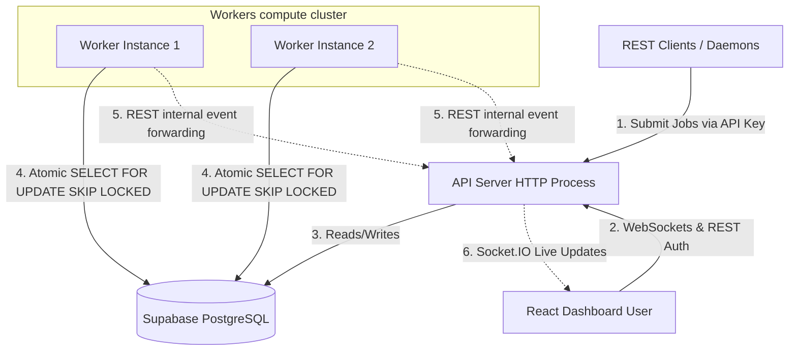
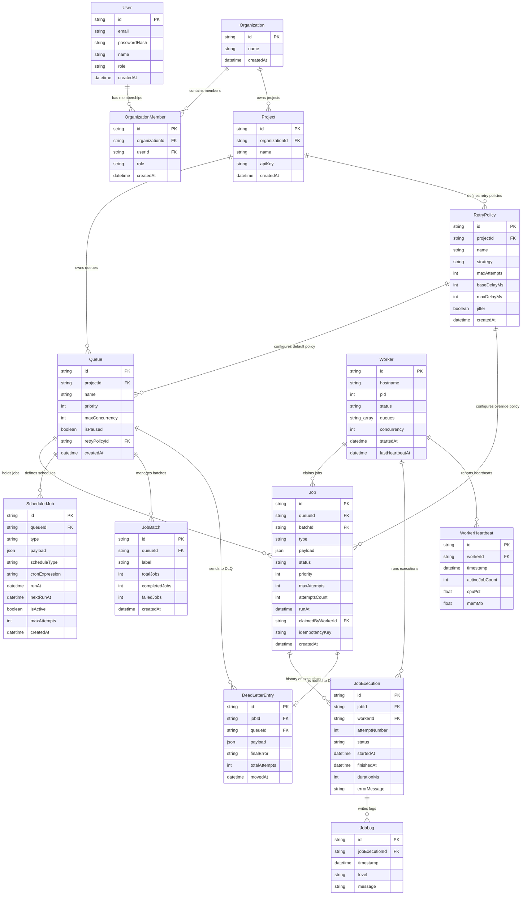

# Distributed Job Scheduler

A highly reliable, production-grade distributed job scheduler built with **Node.js + TypeScript + Prisma + PostgreSQL + React (Vite + Tailwind CSS v4)**.

---

## Features

- **Atomic Claiming:** Implements raw PostgreSQL `SELECT ... FOR UPDATE SKIP LOCKED` inside a transaction per queue to ensure no double-executions, even under massive worker concurrency.
- **Strict Concurrency Limits:** Enforces queue-level concurrency limits by counting active runs before worker claiming.
- **Multi-Tenancy & Isolation:** Double authentication pathways (JWT for dashboard, SHA-256 hashed API Keys for client daemons) with strict project isolation.
- **Resilient Recovery (Reaper):** Detects stalled or crashed workers via a heartbeat watchdog and automatically requeues lost executions.
- **Live Observability:** WebSocket updates via Socket.IO keep the React dashboard synchronized in real-time.
- **Dead Letter Queue (DLQ):** Exhausted job retries automatically route to DLQ with detailed error logs and manual requeuing.

---

## Architecture & Database Design

### System Architecture Diagram
This diagram shows how programmatic REST clients, the browser dashboard, API processes, Supabase DB, and worker processes interact:



### Entity Relationship (ER) Diagram
The comprehensive database schema layout for the 12 normalized tables:



For detailed explanations of major engineering trade-offs, index optimizations, normalization steps, and cascading behavior configurations, please refer to the complete **[DESIGN_DECISIONS.md](file:///Users/yashsrivastava32/.gemini/antigravity-ide/scratch/job-scheduler/DESIGN_DECISIONS.md)** file.

---

## Getting Started

### 1. Prerequisite Configuration

Clone the repository and copy the environment template:
```bash
cp .env.example .env
```
Update `.env` with your PostgreSQL database URL (e.g. Supabase or local instance) and session secret values.

### 2. Database Sync
Apply migrations or sync database schemas directly to the target database:
```bash
npx prisma db push
```

### 3. Local Development

#### Start the API Server:
```bash
npm run dev
```
Starts the API server on `http://localhost:3000`.

#### Start the Worker Processes:
```bash
# Starts a worker polling all queues with 5 slots of concurrency
npm run worker
```

#### Start the React Frontend Dashboard:
```bash
cd frontend
npm run dev
```
Serves the dashboard on `http://localhost:5173`.

---

## Running with Docker Compose

To spin up the entire stack (API, PostgreSQL database, Workers cluster, and Nginx-served Frontend dashboard) with a single command:
```bash
docker-compose up --build
```
- API Server: `http://localhost:3000`
- Frontend Dashboard: `http://localhost:80` (or the mapped Nginx port)
- Workers replica counts can be scaled dynamically.

---

## Running Tests

Execute the test suite (includes unit tests for backoff delays, atomic claim tests under worker concurrency, and worker crash recovery integration tests):
```bash
# Runs the tests in sequence to prevent concurrent DB table conflicts
npx vitest run --no-file-parallelism
```
